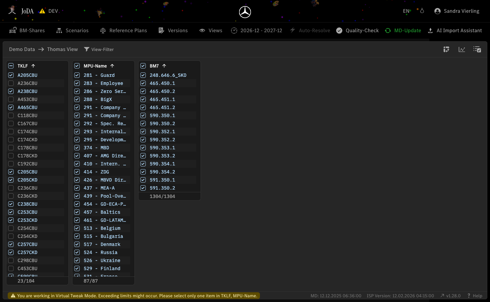

# User Manual — spf-joda.dev.ccosc.app.corpintra.net

*Generated on 2026-02-26 11:43*
*Source: https://spf-joda.dev.ccosc.app.corpintra.net/*

## Table of Contents

1. [JoDA v1.28.0](#section-1)

---

## 1. JoDA v1.28.0 {#section-1}

**URL:** `https://spf-joda.dev.ccosc.app.corpintra.net/`

**Overview:** This page is the **JoDA v1.28.0** page, serving as a content page.

### Key Features

- Action buttons: Sandra Vierling, BM-Shares, Scenarios, Reference Plans, Versions, Views, 2026-12 - 2027-12, Auto-Resolve, Quality-Check, MD-Update

### How to Use

1. Browse the content displayed on this page.

---
